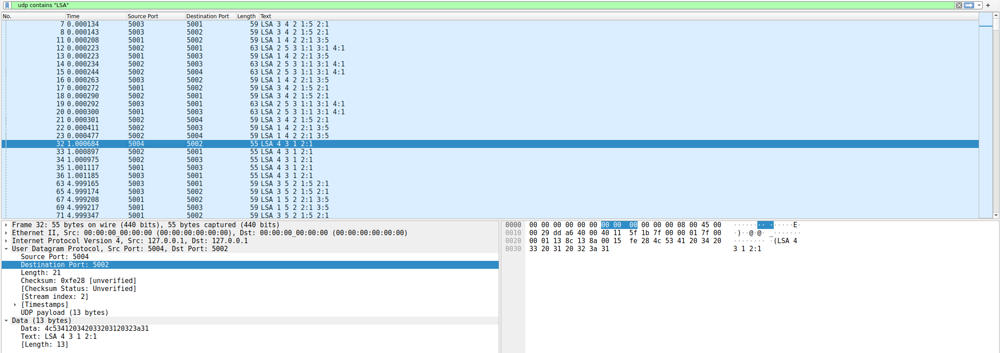
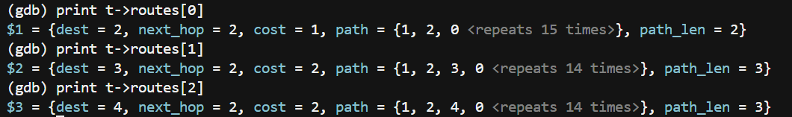

# linkstate-router-sim

A link-state routing simulator in C. Each router is a separate Linux process. Routers exchange messages over UDP, discover the full network by flooding link-state advertisements, and compute shortest-path routing tables with Dijkstra's algorithm. When a router dies, the rest of the network detects it and reroutes.

**Stack:** C11, POSIX sockets, `poll()`, Linux, Python/pytest, tcpdump, Wireshark, gdb

> OSPF-inspired, not an OSPF implementation. It borrows the core ideas (HELLOs, flooded LSAs, sequence numbers, two-way check, aging, SPF) with plain-text messages so the traffic is readable in Wireshark.

## Highlights

- **Routers learn the network themselves.** Each router reads only its own links from `topology.txt`. Everything beyond its neighbors arrives over the network.
- **Picks the cheapest path, not the shortest hop count.** Router 1 reaches Router 3 through Router 2 (cost 2) instead of its direct link (cost 5).
- **Handles failure.** Kill a router and the survivors detect the silence, re-flood their links, and reconverge within seconds.
- **Single-threaded event loop.** One `poll()` loop handles all I/O and timers, with no threads and no blocking reads.
- **End-to-end tests.** Real processes, real sockets, nothing mocked.

For the full design walkthrough (event loop, timer choices, flooding details, gdb recipes), see [docs/DESIGN.md](docs/DESIGN.md).

## Quick start

```sh
make          # builds ./router with zero warnings
./run.sh      # starts routers 1 to 4, logs to logs/r<id>.log
make test     # runs the pytest suite (~50 s)
```

Run a single router:

```sh
./router <id> [topology_file] [--run-for SECONDS] [-v]
```

Router N listens on `127.0.0.1:5000+N`. Ctrl+C prints a final table and exits cleanly.

## Network

```
R1 ---5--- R3
 \        /
  1      1
   \    /
     R2
     |
     1
     |
     R4
```

`topology.txt`:

```
1 2 1
1 3 5
2 3 1
2 4 1
```

## How it works

**HELLO.** Every 1 s, each router sends `HELLO <id>` to its neighbors. A neighbor is UP on its first HELLO and DOWN after 3.5 s of silence.

**LSA.** Each router advertises its currently UP links:

```
LSA <origin> <seq> <count> <nbr>:<cost> ...
LSA 2 7 3 1:1 3:1 4:1      router 2, version 7, three links, all cost 1
```

A new LSA is sent every 5 s, and immediately whenever a neighbor goes UP or DOWN.

**Flooding.** On receiving an LSA, a router stores and forwards it to every neighbor except the sender, but only if its sequence number is newer than the stored copy. Duplicates are dropped, which is what stops flooding from looping forever. LSAs not refreshed within 15 s are discarded.

**Two-way check.** A link is used only if both ends advertise it. This also means a dead router drops out of routing immediately, as soon as its neighbors stop listing it.

**Dijkstra.** O(N²) array-based SPF over up to 16 routers. Ties break toward the lower router ID, so output is deterministic. The table is reprinted only when it changes.

### Source layout

| File | Responsibility |
| --- | --- |
| `src/router.c` | `main`, UDP socket, `poll()` loop, timers, HELLO/LSA handling |
| `src/topology.c` | Parses the topology file, returns only this router's links |
| `src/lsdb.c` | Link-state database: sequence numbers, aging, two-way check, flood decision |
| `src/spf.c` | Dijkstra, routing table construction and printing |

## Example output

Router 1 after convergence:

```
Router 1 routing table
Destination   Next Hop   Cost   Path
2             2          1      1 -> 2
3             2          2      1 -> 2 -> 3
4             2          2      1 -> 2 -> 4
```

Router 1 has no link to Router 4 but learned about it through flooding, and it routes to Router 3 via Router 2 because that path is cheaper than the direct link.

After Router 2 is killed with SIGKILL:

```
Router 1 routing table
Destination   Next Hop   Cost   Path
2             -          inf    unreachable
3             3          5      1 -> 3
4             -          inf    unreachable
```

Router 1 falls back to its direct cost-5 link, and Router 4 is cut off since its only link was through Router 2.

## Testing

| Test | Checks |
| --- | --- |
| `test_full_topology` | All four routers converge to the expected next hop and cost for every destination |
| `test_dijkstra_beats_direct_link` | Router 1 reaches Router 3 via Router 2 at cost 2, not directly at cost 5 |
| `test_router_failure` | After Router 2 is SIGKILLed, Routers 1 and 3 reroute over the cost-5 link and report Router 4 unreachable |

SIGKILL is used so Router 2 dies without warning. The others must detect the failure purely from missing HELLOs.

## Packet capture

```sh
sudo tcpdump -i lo -nn udp portrange 5001-5004 -w docs/capture.pcap
```

Open in Wireshark and filter with `udp contains "LSA"`. Frames 32 to 36 below show Router 4's LSA flooding through the network: R4 sends it to R2, R2 forwards it to R1 and R3, and R1 and R3 forward it to each other, where the duplicates are dropped.



## Debugging with gdb

Built with `-g -O0`. Start routers 2 to 4 first so Router 1 has neighbors, then stop on a fully converged table:

```sh
for id in 2 3 4; do ./router $id --run-for 120 >/dev/null & done
gdb ./router
(gdb) break spf_print_table if t->routes[2].cost != -1
(gdb) run 1
(gdb) print t->routes[2]
$1 = {dest = 4, next_hop = 2, cost = 2, path = {1, 2, 4, 0 <repeats 14 times>}, path_len = 3}
```



## Limitations

- Computes routes only; no data packets are actually forwarded.
- Localhost only, up to 16 routers, addressed by port.
- No authentication or LSA acknowledgements (loopback doesn't drop packets, and periodic refresh covers gaps).
- Link costs are static, read once at startup.
